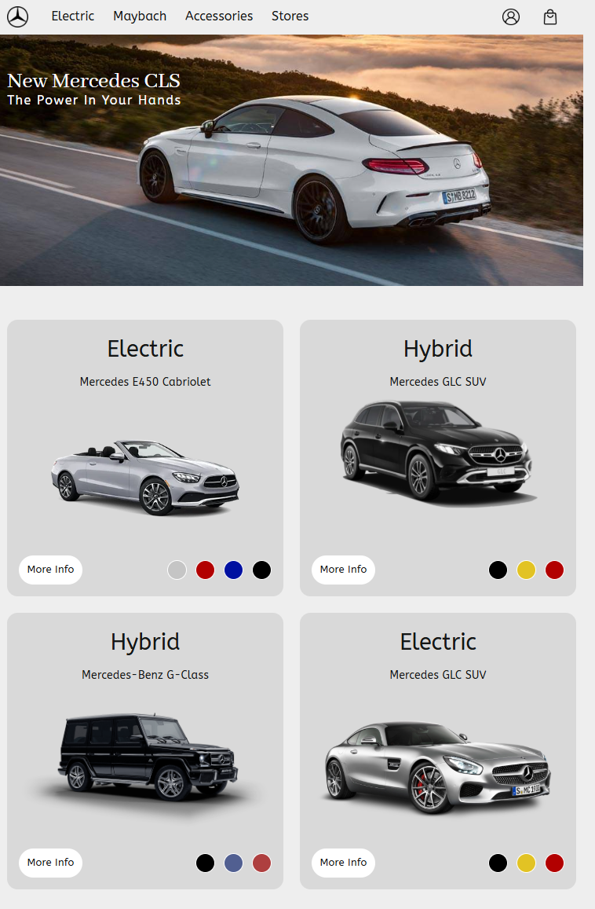
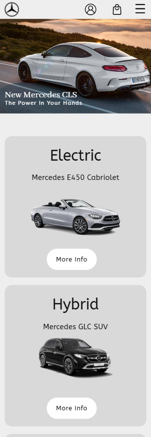
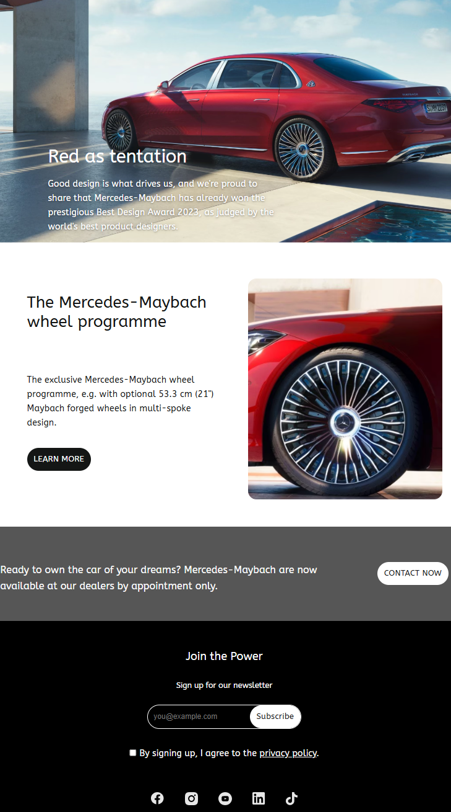
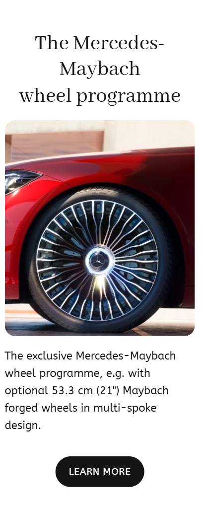

# Mercedes-Benz Landing Page

**[Leer en español](#mercedes-benz-landing-page-es)**

## Description

A fully responsive, static landing page that presents the Mercedes-Benz vehicle lineup and overall brand experience. The site includes an immersive hero section, an interactive car gallery with multiple models and color options, Maybach highlights, a dealership locator, and a newsletter signup form.

The project is built with semantic HTML5, modern CSS layout techniques (Grid and Flexbox), and a small amount of JavaScript to add interactivity where it makes sense.

This was developed as the first project for the **Máster Desarrollador Full Stack** program at [The Power](https://thepowertech.es/rock-the-code) (2025–2026). The focus is on clean, readable code, accessibility best practices, a mobile-first approach, and a modular CSS structure that’s easy to maintain.

## Technologies

- **HTML5** — Semantic markup with accessibility in mind
- **CSS3** — Mobile-first responsive design, CSS custom properties (design tokens), Grid/Flexbox layouts, scroll-snap, and fluid typography with `clamp()`
- **JavaScript (ES6+)** — Mobile navigation toggle, modals, and basic form interactions
- **Google Fonts** — ABeeZee (body text), Abhaya Libre (headings)
- **Netlify** — Static site hosting and deployment

## Live Demo

Live demo 👉 [Mercedes-Benz Landing Page](https://mercedes-landing-page.netlify.app/) on Netlify

## Quickstart

1. Download or clone this repository
2. Open `index.html` directly in your browser  
   _(No build tools, bundlers, or dependencies required — just HTML, CSS, and JS)_

## Screenshots

| Hero / Gallery Desktop | Hero / Gallery Mobile | Maybach Desktop | Maybach Mobile |
| ---- | ---- | ---- | ----- |
|  |  |  |  |

## Project Structure

```
├── index.html              # Main HTML file
├── README.md               # Project documentation
├── agents.md               # Development rules & standards
├── src/
│   ├── css/
│   │   ├── variables.css   # Design tokens 
│   │   ├── main.css        # Global resets and base styles
│   │   ├── utilities.css   # Helper classes
│   │   ├── components/     # Reusable UI components
│   │   │   ├── buttons.css
│   │   │   ├── cards.css
│   │   │   ├── nav.css
│   │   │   ├── forms.css
│   │   │   └── modal.css
│   │   └── sections/       # Section-specific styles
│   │       ├── hero.css
│   │       ├── gallery.css
│   │       ├── dealerships.css
│   │       ├── features.css
│   │       ├── maybach.css
│   │       ├── appointment.css
│   │       └── footer.css
│   ├── js/
│   │   └── main.js         # JavaScript code
│   └── images/             # Project images
│       └── ...
└── docs/                   # Documentation
    ├── emmet-structure.md     
    ├── notes-for-reviewer.md  
    └── shots/                 
```

## Documentation

All project documentation lives in the `/docs` folder, except for `agents.md`, which is kept at the root:

- **[emmet-structure.md](docs/emmet-structure.md)** — Emmet-style DOM blueprint and component reference
- **[notes-for-reviewer.md](docs/notes-for-reviewer.md)** — Project notes and requirements (Spanish) to help navigate the project.
- **[agents.md](agents.md)** — Development rules, naming conventions, and code standards

## References and Sources

- **Figma Design**: https://www.figma.com/design/rNClWJKvueW7qQDXWrtzSg/PROYECTO1
- **Course Program**: https://thepowertech.es/rock-the-code

---

# Mercedes-Benz Landing Page (ES)

[**Read in English**](#mercedes-benz-landing-page)

## Descripción

Landing page estática y completamente responsive que presenta la línea de vehículos y la experiencia de marca de Mercedes-Benz. Incluye una sección hero inmersiva, una galería interactiva de autos con distintos modelos y variantes de color, secciones destacadas de Maybach, un localizador de concesionarios con mapa y un formulario de suscripción a newsletter.

El proyecto está construido con HTML5 semántico, layouts modernos en CSS (Grid y Flexbox) y una cantidad mínima de JavaScript para añadir interactividad de forma controlada.

Se desarrolló como primer proyecto del **Máster Desarrollador Full Stack** en [The Power](https://thepowertech.es/rock-the-code) (2025–2026). El objetivo principal es mantener un código claro y ordenado, cumplir con buenas prácticas de accesibilidad, aplicar un enfoque mobile-first y utilizar una estructura CSS modular y mantenible.

## Tecnologías

- **HTML5** — Etiquetas semánticas, enfoque en accesibilidad
- **CSS3** — Diseño responsive mobile-first, variables css (tokens de diseño), Grid/Flexbox y tipografía fluida con `clamp()`
- **JavaScript (ES6+)** — Navegación móvil, modales e interacciones básicas de formularios
- **Google Fonts** — ABeeZee (texto principal), Abhaya Libre (encabezados)
- **Netlify** — Hosting y despliegue del sitio estático

## Demo en Vivo

Demo en vivo 👉 [Mercedes-Benz Landing Page](https://mercedes-landing-page.netlify.app/) en Netlify

## Inicio Rápido

1. Descarga o clona este repositorio
2. Abre `index.html` directamente en tu navegador  
   _(No se necesitan herramientas de build ni dependencias: solo HTML, CSS y JS)_

## Capturas de Pantalla

| Hero / Gallery Desktop | Hero / Gallery Mobile | Maybach Desktop | Maybach Mobile |
| ---- | ---- | ---- | ----- |
|  |  |  |  |

## Estructura del Proyecto

```

├── index.html              # Archivo HTML principal
├── README.md               # Documentación del proyecto
├── agents.md               # Reglas de desarrollo y estándares
├── src/
│   ├── css/
│   │   ├── variables.css   # Tokens de diseño 
│   │   ├── main.css        # Resets globales y estilos base
│   │   ├── utilities.css   # Clases auxiliares
│   │   ├── components/     # Componentes UI reutilizables
│   │   │   ├── buttons.css
│   │   │   ├── cards.css
│   │   │   ├── nav.css
│   │   │   ├── forms.css
│   │   │   └── modal.css
│   │   └── sections/       # Estilos por sección
│   │       ├── hero.css
│   │       ├── gallery.css
│   │       ├── dealerships.css
│   │       ├── features.css
│   │       ├── maybach.css
│   │       ├── appointment.css
│   │       └── footer.css
│   ├── js/
│   │   └── main.js         # Navegación, modales y formularios
│   └── images/             # Imágenes del proyecto
│       └── ...
└── docs/                   # Documentación del proyecto
    ├── emmet-structure.md        
    ├── notes-for-reviewer.md  
    └── shots/              # Capturas de pantalla

```

## Documentación

Toda la documentación del proyecto se encuentra en `/docs`, salvo `agents.md`, que está en la raíz:

- **[emmet-structure.md](docs/emmet-structure.md)** — Blueprint DOM estilo Emmet y referencia de componentes
- **[notes-for-reviewer.md](docs/notes-for-reviewer.md)** — Cumplimiento de requisitos del proyecto (Español)
- **[agents.md](agents.md)** — Reglas de desarrollo, convenciones y estándares de código

## Referencias y Fuentes

- **Diseño en Figma**: https://www.figma.com/design/rNClWJKvueW7qQDXWrtzSg/PROYECTO1
- **Programa del Curso**: https://thepowertech.es/rock-the-code