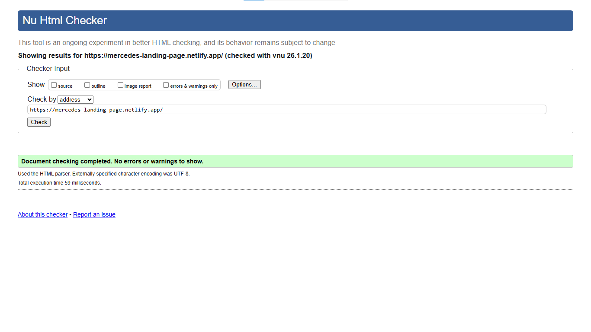
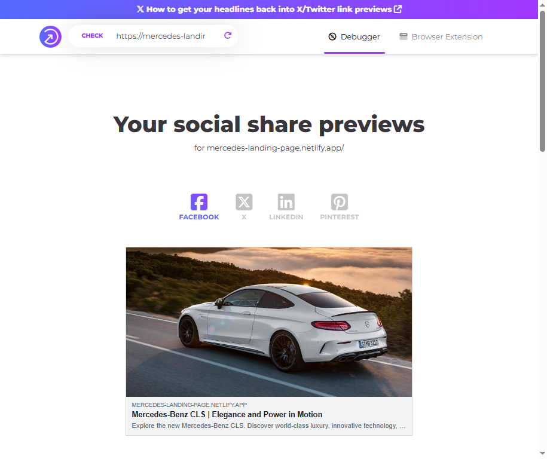

# Notas para la Revisión - RTC Proyecto: Landing Page

Esta sección explica cómo está integrado el proyecto y cómo se dio cumplimiento a cada uno de los requisitos.

Está escrito con la intención de ayudar a navegar a quien vaya a calificar el proyecto.

---

## Información importante sobre este proyecto

### Filosofía de desarrollo

Mi intención era crear un proyecto con una estrategia coherente en lugar de resolver cada sección de forma aislada. Para esto implementé:

- **Sistema de primitivas de layout**: Clases reutilizables que controlan el espaciado y estructura del proyecto completo
  - `.container` → ancho máximo y centrado horizontal
  - `.gutter` → padding horizontal para protección de bordes
  - `.stack` → espaciado vertical entre contenido en flujo
  - `.section` (con variantes) → espaciado vertical entre regiones principales
  - `.split-layout` → estructura de contenido dividido (móvil: apilado, desktop: grid de 2 columnas)

- **Variables CSS**: Sistema centralizado de tokens de diseño (tipografía, colores, espaciado, border-radius, transiciones) definido en `variables.css`

- **Mobile-first**: Todo el proyecto parte de 390px como baseline y crece progresivamente hacia pantallas más grandes

### Estructura de archivos CSS

No me gusta tener un `styles.css` enorme donde hay que hacer scroll infinito para llegar a cada sección, así que dividí el CSS en varios archivos organizados por responsabilidad:

**Archivos base:**
- `variables.css` → Tokens de diseño (colores, tipografía, espaciado, etc.)
- `main.css` → Reset CSS, estilos base de tipografía, primitivas de layout
- `utilities.css` → Clases helper pequeñas (`.sr-only`, `.uppercase`)

**Carpeta `components/`** — Componentes UI reutilizables que se usan en múltiples secciones:
- `buttons.css` → Estilos de botones y sus variantes (`.btn`, `.btn-dark`, `.btn-wide`)
- `cards.css` → Tarjetas base y variantes (`.card`, `.product-card`, `.feature-card`)
- `nav.css` → Navegación principal (header con burger menu móvil)
- `forms.css` → Formulario de newsletter con diseño "pill"
- `modal.css` → Modal de confirmación de newsletter

**Carpeta `sections/`** — Estilos específicos de cada sección de la página:
- `hero.css` → Sección hero con imagen de fondo
- `gallery.css` → Galería de productos (grid responsive)
- `dealerships.css` → Sección de concesionarios con mapa
- `features.css` → Características del producto (scroll horizontal en móvil)
- `maybach.css` → Secciones Maybach Red y Maybach Wheels
- `appointment.css` → Sección "Appointment Only"
- `footer.css` → Footer con redes sociales y navegación

La estructura completa está documentada en el [README.md](../README.md).

### Tabla de referencia rápida por sección

Esta tabla te ayudará a localizar qué archivos revisar para cada sección:

| Sección                          | Archivos CSS                              | JavaScript        |
| -------------------------------- | ----------------------------------------- | ----------------- |
| **Header / Navegación**          | `nav.css`, `buttons.css`                  | `main.js`         |
| **Hero**                         | `hero.css`                                | —                 |
| **Car Gallery**                  | `gallery.css`, `cards.css`, `buttons.css` | —                 |
| **Dealerships**                  | `dealerships.css`, `buttons.css`          | —                 |
| **Features**                     | `features.css`, `cards.css`, `buttons.css`| —                 |
| **Maybach Red**                  | `maybach.css`                             | —                 |
| **Maybach Wheels**               | `maybach.css`, `buttons.css`              | —                 |
| **Appointment**                  | `appointment.css`, `buttons.css`          | —                 |
| **Newsletter**                   | `forms.css`, `buttons.css`                | `main.js`         |
| **Modal** (confirmación)         | `modal.css`, `buttons.css`                | `main.js`         |
| **Footer**                       | `footer.css`                              | —                 |

**Nota:** `main.css` contiene las primitivas de layout que se usan en todas las secciones, pero no lo incluí en la tabla para evitar repetición. Si hay clases como `.container`, `.gutter`, `.stack` o `.section`, sus estilos están ahí.

### Sobre mi agents.md

Usé un `agents.md` escrito por mí misma. Llevo tiempo trabajando en él, intentando crear mis propias reglas para mi flujo de trabajo. Traté de seguirlas lo mejor posible durante el desarrollo. 

Algunas reglas clave:
- **NO uso BEM** — me pone de malas, así que lo evito conscientemente
- **Nomenclatura semántica-funcional** — nombres que describen propósito, no jerarquía
- **Separación de responsabilidades** — layout vs contenido vs comportamiento

### Comentarios en el código

Cada archivo CSS incluye:
- Comentario en la cabecera explicando qué contiene y su propósito
- Comentarios inline cuando son necesarios
- Referencias sobre dónde se aplican los estilos

Lo mismo aplica para `main.js`.

### JavaScript

El proyecto tiene funcionalidad básica:

- **Formulario de newsletter**: Valida datos y muestra un modal de confirmación al hacer submit
- **Navegación móvil**: Burger menu que se desliza desde la derecha en pantallas pequeñas
- **Modal**: Se puede cerrar con el botón X, el botón OK, o presionando Escape

### my_notes.md

Ignorar `my_notes.md` son notas personales con respuestas de IA, errores y explicaciones, etc. 

### Uso de IA

Usé IA para automatizar ciertos procesos, para investigar soluciones o corregir errores y generar documentación.

La estructura del proyecto la cree manualmente siguiendo el archivo Figma y después decidí rehacerlo porque los nombres de las clases eran un desastre. Recreé la misma estructura con IA y mi `agents.md` en este proyecto.

Ese proyecto original está aquí: [Página web](https://mercedes-lp-old.netlify.app/), [Repositorio](https://github.com/candytale55/mercedes-lp)

---

## Requisitos del proyecto

Esta sección incluye los requisitos específicos para el proyecto:

### ✅ Buen uso de variables CSS

Usa un sistema completo de variables CSS en `variables.css`, incluyendo tokens de tipografía (tamaño, peso, altura de línea, familia), colores (primitivos base y semánticos por propósito), espaciado (basado en casos de uso), border-radius, y transiciones. 

Siguen una nomenclatura descriptiva  como `--font-size-heading`, `--spacing-section`, `--color-text-primary`.

### ✅ Reutilización de estilos con el uso de clases

Clases reutilizables organizadas en dos categorías:

1. **Componentes** (`.btn`, `.card`, `.link`) — elementos UI que se repiten en múltiples secciones
2. **Primitivas de layout** (`.section`, `.container`, `.gutter`, `.stack`) — controlan estructura y espaciado

Los componentes admiten modificadores mediante clases adicionales (`.btn-dark`, `.product-card`, `.feature-card`) 

Permite combinar clases para crear variaciones sin duplicar código.

**No uso BEM** porque me pone de malas, así que lo evito mediante una instrucción explícita en `agents.md`. En su lugar uso nombres semánticos que describen propósito, no jerarquía (tiene sus fallos, aún estoy trabajando en esto).

### ✅ Uso de Grid o Flex

El proyecto utiliza ambas tecnologías según el caso de uso:

**CSS Grid** para layouts bidimensionales:
- Galería de productos (1 → 2 → 4 columnas según viewport)
- Footer navigation (auto-fit para crear columnas responsive)
- Secciones con grid-template-areas (Maybach Wheels, Dealerships)
- Header (logo a la izquierda, navegación secundaria a la derecha)

**Flexbox** para layouts unidimensionales:
- Header y navegación
- Alineación de botones
- Stacks verticales (`.stack`)
- Footer social icons

La navegación móvil combina ambas: usa grid para el overlay fullscreen y flexbox para la alineación de elementos internos.

### ✅ Página FULL RESPONSIVE

Diseño mobile-first con breakpoints estratégicos que se adaptan al contenido, no a dispositivos específicos. 

Los breakpoints fueron escogidos en base al aspecto de la página en cada tamaño, observando dónde el diseño necesitaba ajustarse.

**Técnicas responsive usadas:**
- Tipografía fluida con `clamp()` para escalado progresivo
- Imágenes responsivas con `object-fit` y `aspect-ratio`
- Grid adaptable con cambios de columnas según viewport
- Navegación que transforma de overlay (móvil) a horizontal (desktop)
- Ajustes específicos por sección según necesidades de contenido

**Breakpoints principales:** 390px (baseline), 550px, 650px, 768px, 900px, 1200px

### ✅ Ningún error en el HTML

El HTML ha sido validado con [W3C Validator](https://validator.w3.org/) sin errores. 

Página del proyecto: https://mercedes-landing-page.netlify.app/

En el momento de enviar el proyecto, pasaba todas las pruebas. 

Encontré que a veces VisualStudio modifica el código automáticamente al hacer actualizaciones alterando la sintaxis del cierre de etiquetas.  

### ✅ Buena semántica y accesibilidad

Implementación completa de accesibilidad siguiendo estándares WCAG AA:

**Estructura:**
- Un solo `<h1>` por página
- Todas las secciones tienen nombres accesibles (títulos visibles o `.sr-only`)
- Jerarquía de encabezados sin saltos de nivel

**Navegación:**
- Estados ARIA en botones interactivos (`aria-expanded`, `aria-controls`)
- Enlaces con `aria-label` cuando el contexto no es obvio por el texto
- Gestión de foco en menú móvil y modal

**Contenido:**
- Imágenes con texto alternativo descriptivo y específico
- Color dots con `aria-label` indicando la opción de color
- Focus visible en todos los elementos interactivos
- Modal y menú móvil gestionan foco correctamente (focus trap y restauración)

### ✅ Uso de meta etiquetas que mejoran el SEO

El `<head>` incluye meta tags completos y bien organizados:

**SEO básico:**
- Descripción meta
- Canonical URL para evitar contenido duplicado
- Robots index/follow
- Título optimizado

**Social Media (Open Graph):**
- Tags para Facebook, LinkedIn y Discord
- Imagen optimizada 1200x630px con preview

**Twitter Card:**
- Meta tags específicos para Twitter
- Summary large image card

Las etiquetas Open Graph validadas en [socialsharepreview.com](https://socialsharepreview.com/?url=https://mercedes-landing-page.netlify.app/)

### ✅ La web contiene enlaces a productos reales

El proyecto incluye enlaces externos que apuntan a páginas oficiales de Mercedes-Benz España. Todos usan `target="_blank"` y `rel="noopener noreferrer"` para seguridad.

**Estrategia de enlaces:**
- **Enlaces externos**: Botones "More Info" y "Learn More" apuntan a productos reales de Mercedes-Benz
- **Enlaces internos del footer y redes sociales**: Apuntan a IDs internos de su misma sección para evitar saltos a home y `href="#"` vacíos
- **Navbar**: Tiene enlaces a las diferentes secciones de la página mediante IDs (`#electric`, `#maybach`, `#accessories`, `#dealerships`)

---

## Problemas conocidos

Detalles que quedaron pendientes:

### Círculos de colores en car cards

Los círculos de colores deberían ser enlaces a imágenes de los coches en ese color. Como no hay esas imágenes en el proyecto, me pareció que no valía la pena crear los elementos como `<a>`. En la vida real hubieran sido enlaces interactivos que cargan la fotografía en el color indicado.

### Grid de _car cards_ estático

El proyecto trata las tarjetas de car gallery de manera estática (1 → 2 → 4 columnas en breakpoints específicos). En la vida real probablemente usaría un grid con `auto-fill` o `auto-fit` y `minmax()` para controlar el tamaño, dejando que las tarjetas llenen el espacio disponible. 

Pero como solo hay cuatro tarjetas, el resultado quedaba muy feo (tarjetas distribución rara en ciertos viewports).

### Aspect ratio fijo en imágenes

Sé que usar `aspect-ratio` fijo (1/1 para gallery, 4/3 para features) no es la mejor idea, pero la diferencia en el tamaño de las imágenes originales me complicaba mucho mantener un aspecto uniforme. 

Intenté varias opciones (documentadas en `my_notes.md`), pero esta fue la que mejor funcionó para mantener consistencia visual en el proyecto.

### Elemento flecha final del Figma

Me di cuenta del elemento con la flecha al final del diseño Figma justo cuando iba a entregar el proyecto, así que lo dejé fuera. Lo interpreto como un "back to top" link que probablemente quedaría fijo en la parte inferior para que el usuario pueda regresar arriba en cualquier momento.

Espero que no haya problema por no incluirlo — preferiría empezar a trabajar en los siguientes proyectos en lugar de agregar este detalle de última hora.

## References and Sources

- **W3C Validator**: https://validator.w3.org/
- **Social Share Preview**: https://socialsharepreview.com
- **Figma Design**: https://www.figma.com/design/rNClWJKvueW7qQDXWrtzSg/PROYECTO1